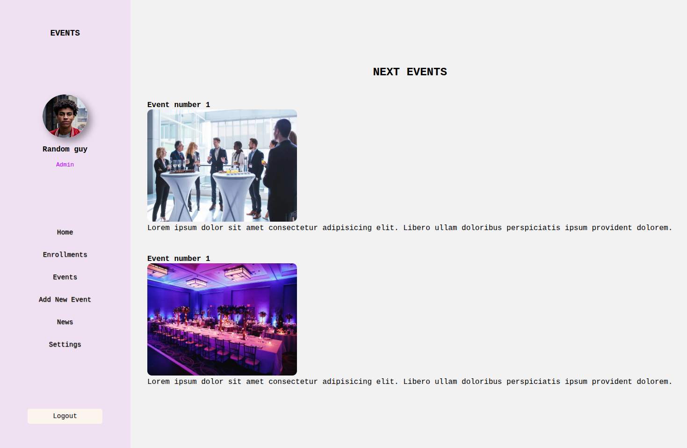
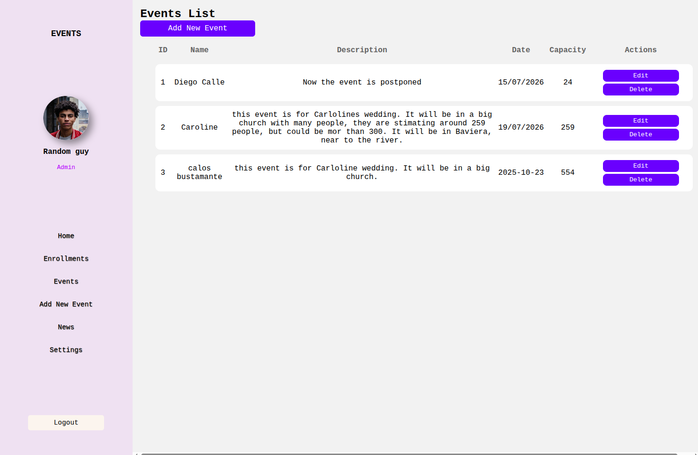
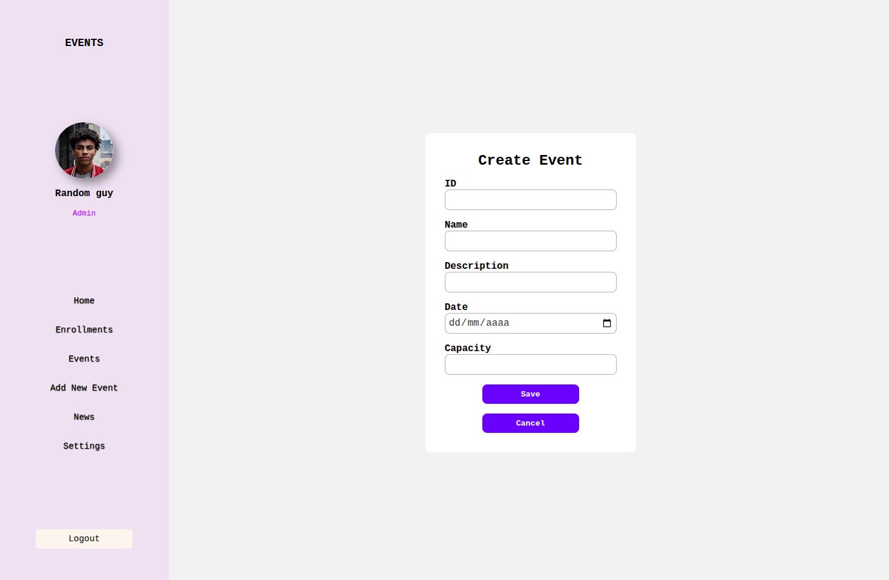
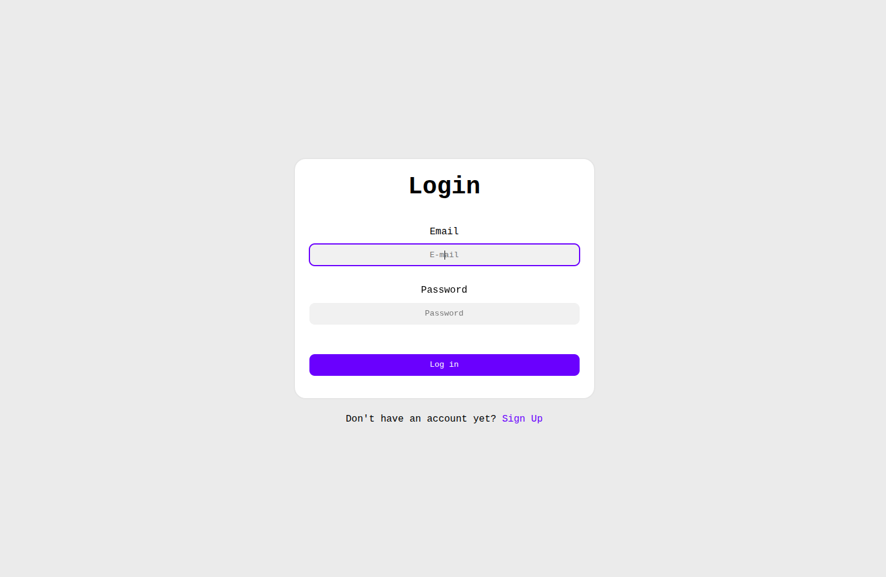
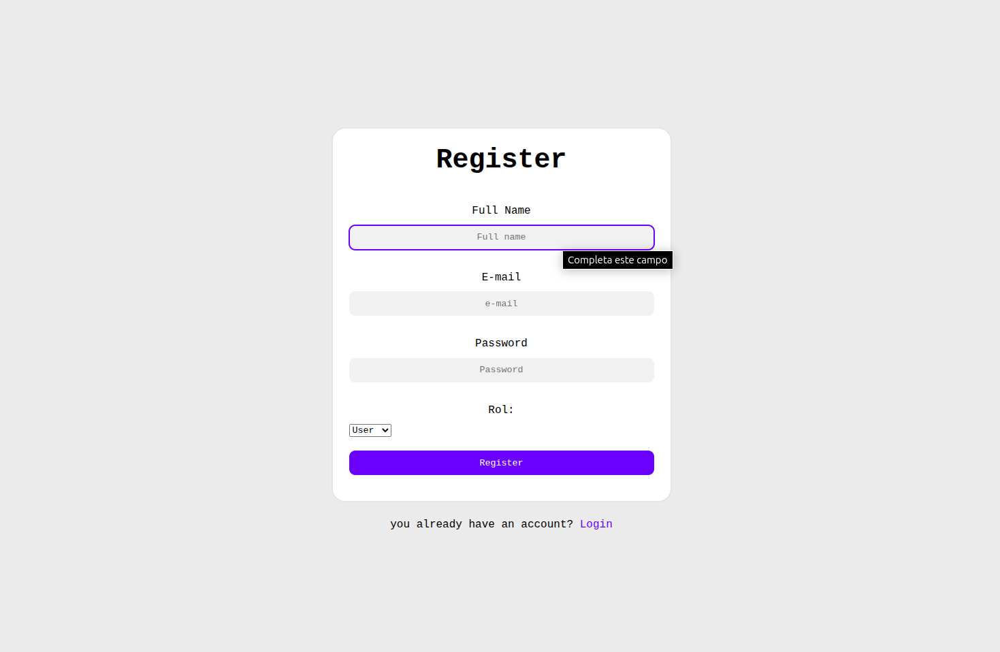

# JavaScript Assessment - M3W5| Riwi
 ### By: Diego Alexander Vallejo Zapata - Clan Hopper
 #### dieego14apu@gmail.com  -  1085310892

 This project is the final assessment for JavaScript module, therefore, I will describe the most important aspects of this software.

 The project was developed for a company that offers services of events. This software is an online platform where it  will manage the information of bookings clients.

 This platform has a longin and a signup page to access to the system, this validation is based in what kind of role has the client in the platform, if he/she is 'admin' they have full access to the system, on the other hand, if the client is only a 'user', they will have only access to specific views on the systen, such as Enrollments and Events. To validate this, we used an structure of SPA (Single Page Application) to show different views, all of this combined at the same time with a validation on localstorage.

 This program is based in apply and using a CRUD (Create, Read, Update and Delete) in JS to manage the events of the company. To get this, I used the followings methods in JS, applied through function "fetch()" to comuninicate with our simulated API, which is hosted on the simulated server with json-server. The methods that I used inside of "fetch()" are:

 - GET: To obtain the data from the database.
 - POST: To create a new register in the DB using a form of html.
 - PUT: To update an specific register through its ID register.
 - DELETE: To delete an specific register on our database.

 The previuous methods are based in HTTP protocols for comunicate JS with the server.

We have the styles that were made on CSS, and last but not least, the buttom to logout is the option to exit of the system.

Finally, it's mandatory that you do your register in signup to access into the system, you can choose your role between "admin" or "user" in the that page, depending of this, you will have full access or not in the platform. 
For the correct use of this software you will need to install npm json-server and npm vite, because the folder that contains these files was ommited when the files were loaded on GitHub through .gitignore.

---
Some of screenshoots of the project:

